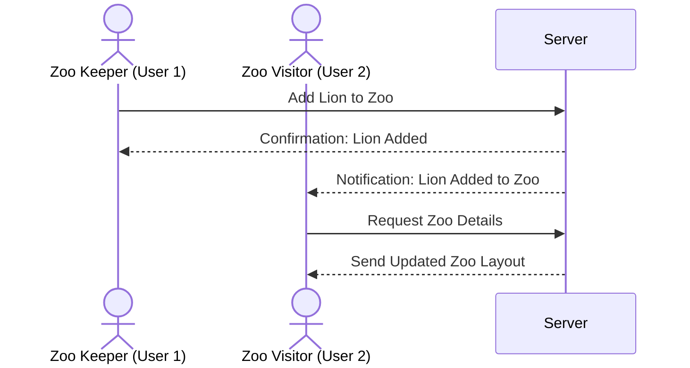

My Zoo

[My Notes](notes.md)

Imagine creating your own dream zoo from anywhere in the world! With the Virtual Zoo App, you can explore a wide variety of animals, add them to your personalized zoo, and learn fascinating facts about each species. Perfect for animal lovers, educators, and kids, this app brings the magic of the animal kingdom to your fingertips.

- [x] Reviewed Markdown

## 🚀 Specification Deliverable

> [!NOTE]
>  Fill in this sections as the submission artifact for this deliverable. You can refer to this [example](https://github.com/webprogramming260/startup-example/blob/main/README.md) for inspiration.

For this deliverable I did the following. I checked the box `[x]` and added a description for things I completed.

- [x] Proper use of Markdown
- [x] A concise and compelling elevator pitch
- [x] Description of key features
- [x] Description of how you will use each technology
- [x] One or more rough sketches of your application. Images must be embedded in this file using Markdown image references.

### Elevator pitch

Ever dreamed of being a zookeeper? The Virtual Zoo App lets you create, customize, and manage your own zoo. Add animals from a wide library, learn fascinating facts, and even share your zoo with friends. Built with education and entertainment in mind, the app is perfect for kids, families, and animal enthusiasts. Learn, play, and grow your dream zoo!

### Design

Homepage: Features a banner, animal search bar, and "Explore Zoo" button.
Animal Browser: Displays animal cards in a grid with filters and a search option.
Zoo Dashboard: Displays the user's current zoo layout with animal cards and options to remove or view more details.
Profile Settings: Page for managing the user's account and preferences.

### Key features

- Explore a library of animals with detailed profiles (API for profiles).
- Customize your own zoo layout with drag-and-drop sections.
- Take interactive quizzes to test your animal knowledge (extra feature).
- Share your zoo and compete with friends.
- Real-time updates for animal library additions and friend activity (mario added a lion to his zoo).

### Technologies

I am going to use the required technologies in the following ways.

- **HTML**: Structure for pages like the animal browser, zoo dashboard, home, quizzes.
- **CSS**: Responsive design and animations.
- **React**: Componentized structure for animal cards, zoo layouts, quizzes, and more.
- **Web Services**: Use the [Zoo Animal API](https://zoo-animal-api.herokuapp.com/ and custom backend endpoints.
- **Authentication**: Secure login and registration with personalized experiences.
- **Database**: Store user data, zoo layouts, animal information, and quiz results.
- **WebSocket**: Real-time updates for new animals and friend activity.

## 🚀 AWS deliverable

For this deliverable I did the following. I checked the box `[x]` and added a description for things I completed.

- [x] **Server deployed and accessible with custom domain name** - [My server link](https://myzoo.click).

## 🚀 HTML deliverable

For this deliverable I did the following. I checked the box `[x]` and added a description for things I completed.

- [x] **HTML pages** - I completed this part by creating the required pages: index.html, manage.html, animals.html, about.html, and login.html.
- [x] **Proper HTML element usage** - I ensured proper use of semantic HTML tags such as <body>, <nav>, <main>, <header>, and <footer> across all pages.
- [x] **Links** - All pages include a navigation bar with links to other pages for easy access.
- [x] **Text** - I added clear, descriptive textual content to each page, explaining its purpose and functionality.
- [x] **3rd party API placeholder** -  I added a placeholder for a 3rd-party API to fetch random animal facts.
- [x] **Images** - Included an image on the Home page and placeholders for animal images in the View Animals page.
- [x] **Login placeholder** - Created a login page with a form for username/password and placeholder functionality for username display.
- [x] **DB data placeholder** - Added a table in the View Animals page to display animal data as a database placeholder.
- [x] **WebSocket placeholder** - Added a placeholder for real-time updates on the Manage Zoo page, along with a sample WebSocket implementation.

## 🚀 CSS deliverable

For this deliverable I did the following. I checked the box `[x]` and added a description for things I completed.

- [x] **Header, footer, and main content body** - Created a consistent layout across all pages using flexbox and CSS variables for styling.
- [x] **Navigation elements** - Navigation menu with hover effects and responsive design that works on both desktop and mobile.
- [x] **Responsive to window resizing** - Used flexbox and responsive units to ensure the site looks good on all screen sizes.
- [x] **Application elements** - Styled forms, tables, and buttons with a consistent green theme and modern look.
- [x] **Application text content** - Used consistent fonts, sizes, and colors across all pages.
- [x] **Application images** - Added rounded corners and shadow effects to images for visual appeal.
- [x] **Modular CSS** - Implemented a base.css file for shared styles and separate CSS files for each page's specific styling needs.
- [x] **Color scheme** - Used CSS variables to maintain a consistent green color scheme throughout the application.
- [x] **Animations** - Added hover effects on navigation links and buttons for better interactivity.
- [x] **Forms and tables** - Styled forms with consistent spacing and modern input fields. Tables have alternating row colors and hover effects.

## 🚀 React part 1: Routing deliverable

For this deliverable I did the following. I checked the box `[x]` and added a description for things I completed.

- [x] **Bundled using Vite** - Set up the project using Vite for efficient development and bundling. Created vite.config.js with React plugin and development server configuration.

- [x] **Components** - Created several React components:
  - Navigation.jsx - Handles the navigation bar and login state
  - Home.jsx - Displays the welcome page and zoo entrance
  - About.jsx - Shows information about the application
  - Animals.jsx - Displays the list of animals in a table
  - Login.jsx - Handles user authentication
  - Manage.jsx - Provides interface for adding/removing animals
  - Footer.jsx - Displays the footer across all pages

- [x] **Router** - Implemented React Router for client-side routing:
  - Set up BrowserRouter in index.jsx
  - Created routes in App.jsx for all pages (/home, /about, /animals, /manage, /login)
  - Used Link components in Navigation for smooth client-side navigation
  - Protected routes based on login state
  - Implemented proper navigation after login/logout

## 🚀 React part 2: Reactivity deliverable

For this deliverable I did the following:

- [x] **Component state** - Added state management for animal weights and feeding functionality
- [x] **Component communication** - Implemented:
  - Context (ZooContext) for managing animal data
  - Props for component configuration
  - Event handlers for user interactions
- [x] **Lifecycle management** - Used useEffect to persist animal data in localStorage
- [x] **User interaction** - Added:
  - Feed button that increases animal weight
  - Euthanize button for removing animals
  - Search and filter functionality for animals
- [x] **Application is responsive** - All components maintain functionality across screen sizes

## 🚀 Service Deliverable

For this deliverable, I did the following. I checked the box `[x]` and added a description for things I completed.

- [x] **Node.js/Express HTTP service** - Created a Node.js/Express service with endpoints for user registration, login, and animal facts. The server is set up in `service/index.js` and includes a test endpoint to verify server functionality.
- [x] **Static middleware for frontend** - Set up Express static middleware to serve the React frontend, ensuring seamless integration between the backend and frontend.
- [x] **Calls to third-party service endpoints** - Implemented a simulated animal facts API endpoint in `src/about/about.jsx` to fetch random animal facts.
- [x] **Backend service endpoints** - Created endpoints for user registration (`/api/register`), login (`/api/login`), and animal management (`/api/animals`). These endpoints are defined in `service/index.js` and `service/routes/animals.js`.
- [x] **Frontend calls service endpoints** - Updated React components in `src/context/ZooContext.jsx`, `src/login/login.jsx`, and `src/register/Register.jsx` to call the backend service endpoints for fetching, adding, and removing animals, as well as user authentication.

## 🚀 DB/Login deliverable

For this deliverable I implemented user authentication and MongoDB integration:

- [x] **User registration** - Created a registration form with validation in `src/auth/Auth.jsx` that allows users to create accounts. The backend endpoint in `service/auth.js` handles user creation in MongoDB with secure password hashing via bcrypt.

- [x] **User login and logout** - Built login functionality with JWT token authentication. The login form in `src/auth/Auth.jsx` authenticates users against the database. Authentication state is maintained using localStorage and a custom `AuthContext` that provides login state across the application. Logout functionality clears credentials from storage.

- [x] **Stores data in MongoDB** - Connected to MongoDB using Mongoose. Created schemas for Users (`service/User.js`) and Zoo animals (`service/Animal.js`). All animal data is now persistently stored in MongoDB collections.

- [x] **Stores credentials in MongoDB** - User credentials are securely stored in MongoDB with passwords encrypted using bcrypt. The User schema in `service/User.js` includes a pre-save hook that automatically hashes passwords before storing them.

- [x] **Restricts functionality based on authentication** - Added protected routes in `src/components/ProtectedRoute.jsx` that require authentication. Zoo management (`/manage`) and animal viewing (`/animals`) are now restricted to logged-in users only. The authentication is enforced both on the frontend and backend using JWT verification middleware.

### Technical Implementation Details

- Used Mongoose for MongoDB object modeling
- Implemented JWT for stateless authentication
- Created middleware for route protection on the backend
- Built a context-based authentication system on the frontend
- Added proper error handling for authentication failures
- Implemented secure password storage with bcrypt hashing

## 🚀 WebSocket deliverable

For this deliverable I did the following. I checked the box `[x]` and added a description for things I completed.

- [x] **Backend listens for WebSocket connection** - Created a WebSocket server in `service/index.js` that listens for connections from the frontend.
- [x] **Frontend makes WebSocket connection** - Implemented a WebSocket client in `src/context/WebSocketContext.jsx` that connects to the server.
- [x] **Data sent over WebSocket connection** - Set up real-time animal activity notifications using WebSockets. When a user adds or removes an animal, this information is broadcast to all connected clients.
- [x] **WebSocket data displayed** - Added a notification component that displays real-time updates about animal additions and removals from other users.
- [x] **Application is fully functional** - The application now includes all required features: MongoDB storage, user authentication, and real-time WebSocket notifications.
