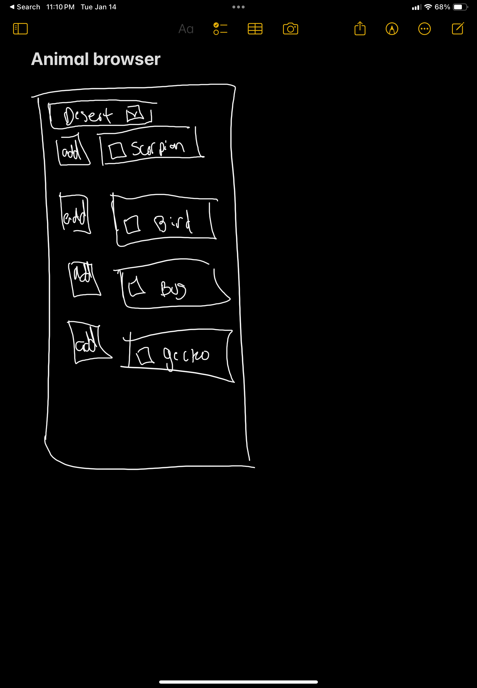
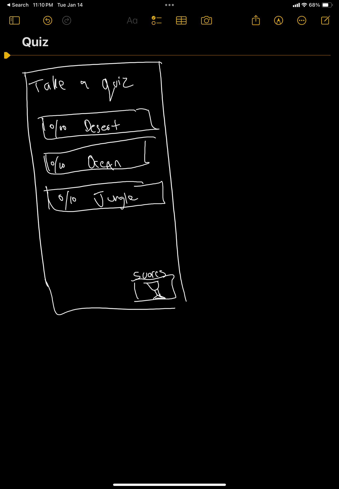
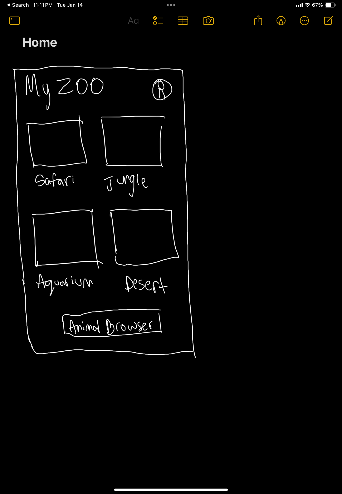
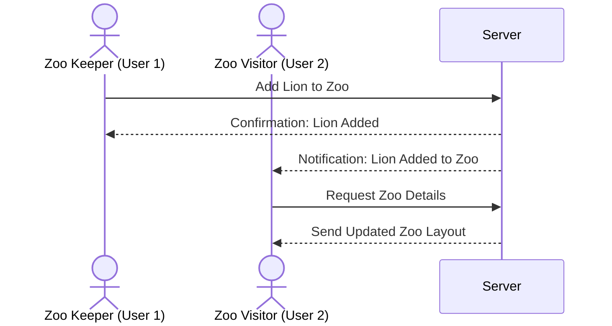

My Zoo

[My Notes](notes.md)

Imagine creating your own dream zoo from anywhere in the world! With the Virtual Zoo App, you can explore a wide variety of animals, add them to your personalized zoo, and learn fascinating facts about each species. Perfect for animal lovers, educators, and kids, this app brings the magic of the animal kingdom to your fingertips.

- [x] Reviewed Markdown

## 🚀 Specification Deliverable

> [!NOTE]
>  Fill in this sections as the submission artifact for this deliverable. You can refer to this [example](https://github.com/webprogramming260/startup-example/blob/main/README.md) for inspiration.

For this deliverable I did the following. I checked the box `[x]` and added a description for things I completed.

- [x] Proper use of Markdown
- [x] A concise and compelling elevator pitch
- [x] Description of key features
- [x] Description of how you will use each technology
- [x] One or more rough sketches of your application. Images must be embedded in this file using Markdown image references.

### Elevator pitch

Ever dreamed of being a zookeeper? The Virtual Zoo App lets you create, customize, and manage your own zoo. Add animals from a wide library, learn fascinating facts, and even share your zoo with friends. Built with education and entertainment in mind, the app is perfect for kids, families, and animal enthusiasts. Learn, play, and grow your dream zoo!

### Design

Homepage: Features a banner, animal search bar, and "Explore Zoo" button.
Animal Browser: Displays animal cards in a grid with filters and a search option.
Zoo Dashboard: Displays the user's current zoo layout with animal cards and options to remove or view more details.
Profile Settings: Page for managing the user's account and preferences.

### Key features

- Explore a library of animals with detailed profiles (API for profiles).
- Customize your own zoo layout with drag-and-drop sections.
- Take interactive quizzes to test your animal knowledge (extra feature).
- Share your zoo and compete with friends.
- Real-time updates for animal library additions and friend activity (mario added a lion to his zoo).

### Technologies

I am going to use the required technologies in the following ways.

- **HTML**: Structure for pages like the animal browser, zoo dashboard, home, quizzes.
- **CSS**: Responsive design and animations.
- **React**: Componentized structure for animal cards, zoo layouts, quizzes, and more.
- **Web Services**: Use the [Zoo Animal API](https://zoo-animal-api.herokuapp.com/ and custom backend endpoints.
- **Authentication**: Secure login and registration with personalized experiences.
- **Database**: Store user data, zoo layouts, animal information, and quiz results.
- **WebSocket**: Real-time updates for new animals and friend activity.

## 🚀 AWS deliverable

For this deliverable I did the following. I checked the box `[x]` and added a description for things I completed.

- [x] **Server deployed and accessible with custom domain name** - [My server link](https://myzoo.click).

## 🚀 HTML deliverable

For this deliverable I did the following. I checked the box `[x]` and added a description for things I completed.

- [x] **HTML pages** - I completed this part by creating the required pages: index.html, manage.html, animals.html, about.html, and login.html.
- [x] **Proper HTML element usage** - I ensured proper use of semantic HTML tags such as <body>, <nav>, <main>, <header>, and <footer> across all pages.
- [x] **Links** - All pages include a navigation bar with links to other pages for easy access.
- [x] **Text** - I added clear, descriptive textual content to each page, explaining its purpose and functionality.
- [x] **3rd party API placeholder** -  I added a placeholder for a 3rd-party API to fetch random animal facts.
- [x] **Images** - Included an image on the Home page and placeholders for animal images in the View Animals page.
- [x] **Login placeholder** - Created a login page with a form for username/password and placeholder functionality for username display.
- [x] **DB data placeholder** - Added a table in the View Animals page to display animal data as a database placeholder.
- [x] **WebSocket placeholder** - Added a placeholder for real-time updates on the Manage Zoo page, along with a sample WebSocket implementation.

## 🚀 CSS deliverable

For this deliverable I did the following. I checked the box `[x]` and added a description for things I completed.

- [x] **Header, footer, and main content body** - Created a consistent layout across all pages using flexbox and CSS variables for styling.
- [x] **Navigation elements** - Navigation menu with hover effects and responsive design that works on both desktop and mobile.
- [x] **Responsive to window resizing** - Used flexbox and responsive units to ensure the site looks good on all screen sizes.
- [x] **Application elements** - Styled forms, tables, and buttons with a consistent green theme and modern look.
- [x] **Application text content** - Used consistent fonts, sizes, and colors across all pages.
- [x] **Application images** - Added rounded corners and shadow effects to images for visual appeal.
- [x] **Modular CSS** - Implemented a base.css file for shared styles and separate CSS files for each page's specific styling needs.
- [x] **Color scheme** - Used CSS variables to maintain a consistent green color scheme throughout the application.
- [x] **Animations** - Added hover effects on navigation links and buttons for better interactivity.
- [x] **Forms and tables** - Styled forms with consistent spacing and modern input fields. Tables have alternating row colors and hover effects.

## 🚀 React part 1: Routing deliverable

For this deliverable I did the following. I checked the box `[x]` and added a description for things I completed.

- [ ] **Bundled using Vite** - I did not complete this part of the deliverable.
- [ ] **Components** - I did not complete this part of the deliverable.
- [ ] **Router** - Routing between login and voting components.

## 🚀 React part 2: Reactivity

For this deliverable I did the following. I checked the box `[x]` and added a description for things I completed.

- [ ] **All functionality implemented or mocked out** - I did not complete this part of the deliverable.
- [ ] **Hooks** - I did not complete this part of the deliverable.

## 🚀 Service deliverable

For this deliverable I did the following. I checked the box `[x]` and added a description for things I completed.

- [ ] **Node.js/Express HTTP service** - I did not complete this part of the deliverable.
- [ ] **Static middleware for frontend** - I did not complete this part of the deliverable.
- [ ] **Calls to third party endpoints** - I did not complete this part of the deliverable.
- [ ] **Backend service endpoints** - I did not complete this part of the deliverable.
- [ ] **Frontend calls service endpoints** - I did not complete this part of the deliverable.

## 🚀 DB/Login deliverable

For this deliverable I did the following. I checked the box `[x]` and added a description for things I completed.

- [ ] **User registration** - I did not complete this part of the deliverable.
- [ ] **User login and logout** - I did not complete this part of the deliverable.
- [ ] **Stores data in MongoDB** - I did not complete this part of the deliverable.
- [ ] **Stores credentials in MongoDB** - I did not complete this part of the deliverable.
- [ ] **Restricts functionality based on authentication** - I did not complete this part of the deliverable.

## 🚀 WebSocket deliverable

For this deliverable I did the following. I checked the box `[x]` and added a description for things I completed.

- [ ] **Backend listens for WebSocket connection** - I did not complete this part of the deliverable.
- [ ] **Frontend makes WebSocket connection** - I did not complete this part of the deliverable.
- [ ] **Data sent over WebSocket connection** - I did not complete this part of the deliverable.
- [ ] **WebSocket data displayed** - I did not complete this part of the deliverable.
- [ ] **Application is fully functional** - I did not complete this part of the deliverable.
